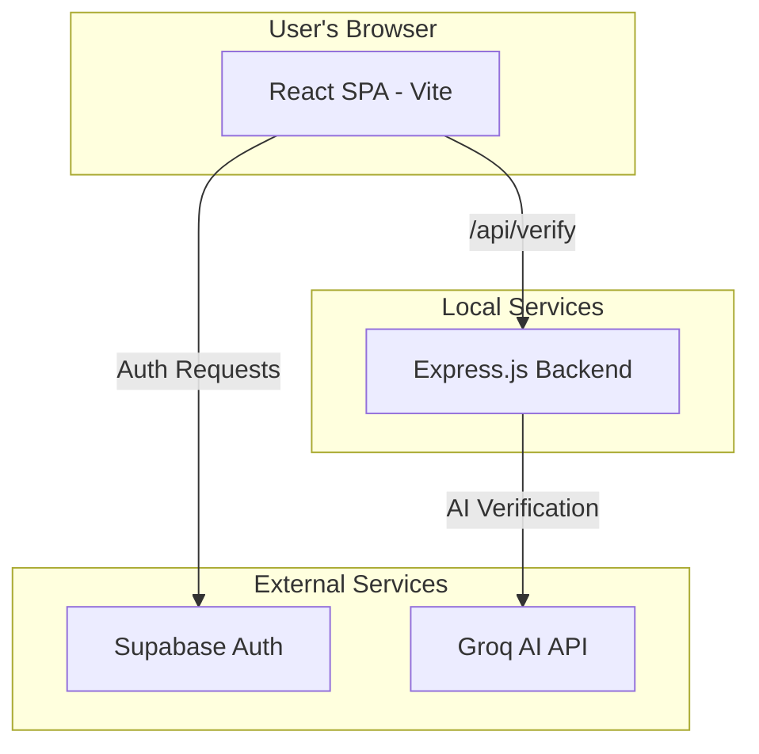

# Tanglaw: Trusted Information Within Reach, Anywhere

**Tanglaw** is an offline-first Media and Information Literacy (MIL) platform designed to help digitally marginalized Filipino communities access, evaluate, and verify information, especially during crises and misinformation events.

Developed as a capstone project and for the **UNESCO Youth Hackathon 2026**, Tanglaw aims to bridge the information gap by providing accessible tools that work even with limited or no internet connectivity.

The majority of the application's design and implementation was led by **Anne Carol G. Jonson**.

---

## Table of Contents

1.  Problem Statement
2.  Solution Description
3.  Target Users
4.  Key Features
5.  Technology Stack
6.  System Architecture
7.  Project Structure
8.  Data Persistence
9.  Installation and Setup
10. Available Scripts
11. Limitations
12. Future Improvements
13. License
14. Acknowledgments
15. FE-05 Accessibility Playground

---

## Problem Statement

In the Philippines, the rapid spread of misinformation and disinformation poses a significant threat to communities, particularly those with limited digital literacy and unreliable internet access. This "information poverty" is exacerbated during natural disasters, health crises, and elections, when timely, accurate information is critical for making life-saving decisions.

Key challenges include:
*   **Connectivity Inequality**: A significant portion of the population relies on costly and unstable mobile data, with many rural and geographically isolated areas (GIDAs) lacking reliable internet infrastructure.
*   **Accessibility Gaps**: Existing fact-checking tools are often data-intensive, complex, and not designed for users with varying levels of digital literacy or accessibility needs.
*   **Crisis Communication Failures**: During emergencies, official communication channels can be disrupted, leaving communities vulnerable to scams, false advisories, and dangerous rumors.

Tanglaw addresses these challenges by providing an **offline-first, community-centric platform** that empowers users to verify information and build media literacy skills, regardless of their connectivity status.

## Solution Description

Tanglaw is a web application that provides a suite of tools for information verification and media literacy education. Its architecture prioritizes local processing and offline access, ensuring core functionality remains available when users need it most.

The core pillars of the solution are:

*   **Explainable AI Verification (Liyab)**: Users can submit suspicious text or images to Liyab, an AI assistant. Instead of a simple "true/false" verdict, Liyab provides an explanation, highlights potential manipulation techniques (like emotional language or urgency), and suggests safe next steps. This is powered by the Groq API on the backend.
*   **Learning Center**: An interactive module with lessons on topics like spotting fake headlines, identifying visual misinformation, and avoiding scams. Progress is tracked locally, allowing users to learn at their own pace, even offline.
*   **Truth Hub Network**: A directory of community-based verification centers (e.g., libraries, schools, barangay halls) where users can get in-person assistance. The "Near Me" feature sorts hubs based on pre-computed distance data to simulate location-based discovery without requiring live geolocation.
*   **Crisis Verification Mode**: A special mode that prioritizes official advisories and critical information from trusted sources during emergencies.
*   **Community-Centric Design**: The platform is built to be approachable and intuitive, with a friendly mascot (Liyab) guiding users through complex tasks.

## Target Users

Tanglaw is designed for a diverse range of users in the Philippines, with a focus on those most vulnerable to misinformation:

*   **Digitally Marginalized Communities**: Residents in rural, remote, or low-income areas with unstable internet.
*   **Students and Educators**: Schools can use the Learning Center as a tool for Media and Information Literacy education.
*   **Senior Citizens and Families**: Individuals who may be targeted by online scams and need simple, trustworthy verification tools.
*   **Community Leaders & Volunteers**: Barangay officials and NGOs can use Tanglaw to disseminate verified information and monitor local misinformation trends.
*   **Humanitarian Responders**: Organizations can leverage Crisis Mode to share trusted advisories during emergencies.

## Key Features

*   **AI-Powered Verification**: Submit text to the backend for analysis by the Groq LLaMA 3 model. The frontend displays an explainable result.
*   **Learning Center**: A complete module with static lessons, quizzes, and explanations on Media and Information Literacy. User progress is saved in `localStorage`.
*   **Truth Hub Directory**: Browse a static list of community verification centers. Includes search by name/address and filtering by type/status.
*   **Supabase Authentication**: Full user registration and login system powered by Supabase Auth, including email confirmation and password resets.
*   **Demo Authentication Mode**: A `localStorage`-based mock authentication system for local development and presentations, enabled via an environment variable.
*   **Responsive Design**: The UI is fully responsive for mobile, tablet, and desktop devices using Tailwind CSS.
*   **Light & Dark Modes**: Supports both themes with a toggle for user preference.
*   **Express Backend Server**: A simple Node.js/Express server run with `tsx` to handle API requests like AI verification.

## Technology Stack

| Category          | Technology                                                                                             |
| ----------------- | ------------------------------------------------------------------------------------------------------ |
| **Frontend**      | React 18, TypeScript, Vite |
| **Styling**       | Tailwind CSS, PostCSS                               |
| **UI / Components** | shadcn/ui, Radix UI, Lucide React |
| **Animation**     | Framer Motion                                                        |
| **Charts**        | Recharts                                                                      |
| **Routing**       | React Router                                                               |
| **Backend**       | Node.js, Express, TSX |
| **AI Service**    | Groq (via API)                                                                    |
| **Authentication**| Supabase                                                                      |
| **Data Persistence**| `localStorage` (for demo mode and user preferences)                                                    |
| **Testing**       | Vitest                                                                          |

## System Architecture

Tanglaw is a Single Page Application (SPA) with a supporting backend for specific API tasks.



1.  **Frontend**: A React application built with Vite and TypeScript. It handles all UI rendering, routing, and state management. It communicates with Supabase for authentication and makes API calls to its own backend.
2.  **Backend**: A simple Express server that exposes an `/api/verify` endpoint. This server acts as a secure proxy to communicate with the Groq API, keeping the API key off the client.
3.  **Authentication**: Handled by Supabase. The frontend client uses the Supabase SDK to manage user sessions, registration, and login.
4.  **Local Persistence**: The application uses the browser's `localStorage` to persist the UI theme (light/dark) and to store session data for the optional demo authentication mode.

## Project Structure

The repository is organized into a frontend application and a backend server.

```
tanglaw/
├── backend/
│   └── src/
│       └── server.ts       # Express server entry point
├── public/                 # Static assets
├── src/
│   ├── app/
│   │   ├── auth/           # Authentication logic and components
│   │   ├── lib/            # Shared logic and utilities
│   │   └── pages/          # Main page components (Truth Hub, Learn, etc.)
│   ├── assets/             # Images, icons, etc.
│   ├── components/         # Reusable UI components (shadcn/ui)
│   ├── hooks/              # Custom React hooks
│   ├── main.tsx            # Main application entry point
│   └── vite-env.d.ts       # Vite TypeScript environment types
├── .env.example            # Environment variable template
├── package.json            # Project dependencies and scripts
├── tsconfig.json           # TypeScript configuration
├── vite.config.ts          # Vite configuration
└── README.md               # This file
```

*   `backend/src/`: Contains the Node.js Express server code.
*   `src/`: Contains all frontend React application code.
*   `src/app/pages/`: Defines the main pages of the application, such as the Dashboard, Learn, and Truth Hub.
*   `src/components/ui/`: Contains reusable UI components, largely based on shadcn/ui.
*   `src/app/auth/`: Manages authentication logic, including Supabase integration and the demo mode.

## Data Persistence

The application uses two methods for data persistence:

1.  **Supabase**: For production-level authentication, Supabase is the source of truth for user identity and session management. User profiles are created in the Supabase database via a trigger on new user registration.

2.  **Browser `localStorage`**: For client-side state that needs to persist across sessions. This is currently used for:
    *   **Theme Preference**: Stores whether the user has selected 'light' or 'dark' mode.
    *   **Demo Mode Authentication**: When `VITE_DEMO_AUTH_ENABLED` is `true`, a mock user session is stored here to simulate a logged-in state without hitting a real backend.

Data in `localStorage` is browser-specific and is not synchronized across devices.

## Installation and Setup

Follow these steps to run the project locally.

### Prerequisites

*   Node.js (v18.x or higher recommended)
*   npm (v9.x or higher)

### 1. Clone the Repository

```bash
git clone <repository-url>
cd tanglaw
```

### 2. Install Dependencies

```bash
npm install
```

### 3. Configure Environment Variables

Copy the example environment file to create a local configuration.

```bash
cp .env.example .env.local
```

Now, open `.env.local` and fill in the required values:

```env
# For Supabase authentication
VITE_SUPABASE_URL=https://your-supabase-url.supabase.co
VITE_SUPABASE_ANON_KEY=your_supabase_anon_key

# Set to 'true' to use mock authentication, 'false' to use Supabase
VITE_DEMO_AUTH_ENABLED=true

# For the backend AI verification service
GROQ_API_KEY=your_groq_api_key
```

*   You can get Supabase and Groq keys from their respective websites.
*   For initial local testing, you can leave `VITE_DEMO_AUTH_ENABLED=true` to bypass the need for Supabase setup.

### 4. Run the Application

To run both the frontend and backend servers concurrently, use the `dev:full` script.

```bash
npm run dev:full
```

This will start:
*   The Vite development server for the frontend (usually on `http://localhost:5173`).
*   The Express backend server (on `http://localhost:3001`).

You can now open `http://localhost:5173` in your browser.

## Available Scripts

| Script         | Description                                            |
| -------------- | ------------------------------------------------------ |
| `npm run dev`    | Starts the frontend Vite development server only.      |
| `npm run server` | Starts the backend Express server only.                |
| `npm run dev:full`| Starts both frontend and backend servers concurrently. |
| `npm run build`  | Builds the frontend application for production.        |
| `npm run preview`| Previews the production build locally.                 |
| `npm run test`   | Runs unit tests with Vitest.                           |
| `npm run typecheck`| Checks the project for TypeScript errors.              |
| `npm run dev:playground` | Starts the standalone FE-05 manual component playground. But needs to type manually the http://localhost:5173/playground/ to open the playground |
| `npm run build:playground` | Builds the standalone FE-05 playground. |

## FE-05 Accessibility Playground

`playground/` contains small, manual React + TypeScript examples of an accessible modal dialog, tabs, and disclosure. It is an educational accessibility exercise, separate from Tanglaw's production routes and components. The application continues to use its existing shadcn/ui wrappers around Radix UI primitives; see `NOTES.md` for the implementation comparison and limitations of the manual examples.

## Limitations

As a capstone prototype, the project has several limitations:

*   **Mocked Synchronization**: Offline and peer-to-peer data synchronization are conceptual and simulated on the frontend. There is no real-time backend for this functionality.
*   **Static Data**: Many features, such as the Learning Center lessons and Truth Hub locations, use static, hardcoded data. They are not populated from a dynamic database.
*   **Browser-Based Persistence**: Outside of Supabase authentication, data persistence relies on `localStorage`, which is not robust and is specific to a single browser on a single device.
*   **AI Scope**: The AI verification is a prototype and its effectiveness depends entirely on the underlying LLM's capabilities and the quality of the prompt.

## Future Improvements

*   **Production Backend**: Replace the simple Express server and static data with a full-fledged backend and database (e.g., using PostgreSQL with Supabase) to manage all application data dynamically.
*   **Real-time Synchronization**: Implement a real-time service (e.g., using WebSockets or Supabase Realtime) to enable community features and synchronization.
*   **Progressive Web App (PWA)**: Convert the application into a PWA with a service worker to improve offline capabilities and caching.
*   **Expanded Learning Content**: Allow administrators to add and manage learning modules through a CMS.
*   **Advanced Moderation**: Build tools for community moderators to manage user-generated content and reports.

## License

This project does not currently have an explicit open-source license. All rights are reserved.

## Acknowledgments

*   This project was developed in fulfillment of capstone project requirements and for participation in the **UNESCO Youth Hackathon 2026**.
*   UI components are heavily based on the excellent shadcn/ui.
*   Icons are provided by Lucide.
*   Photos are from Unsplash.
